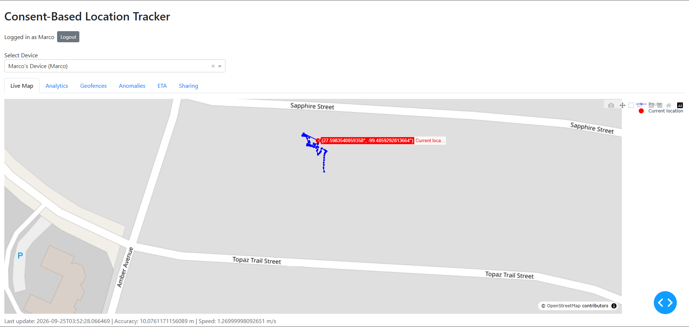
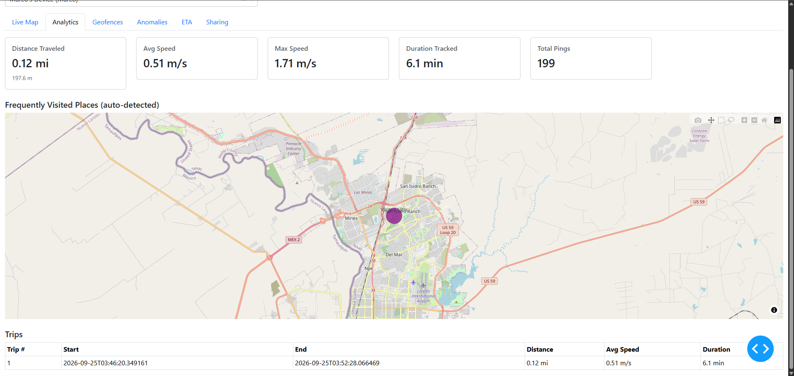
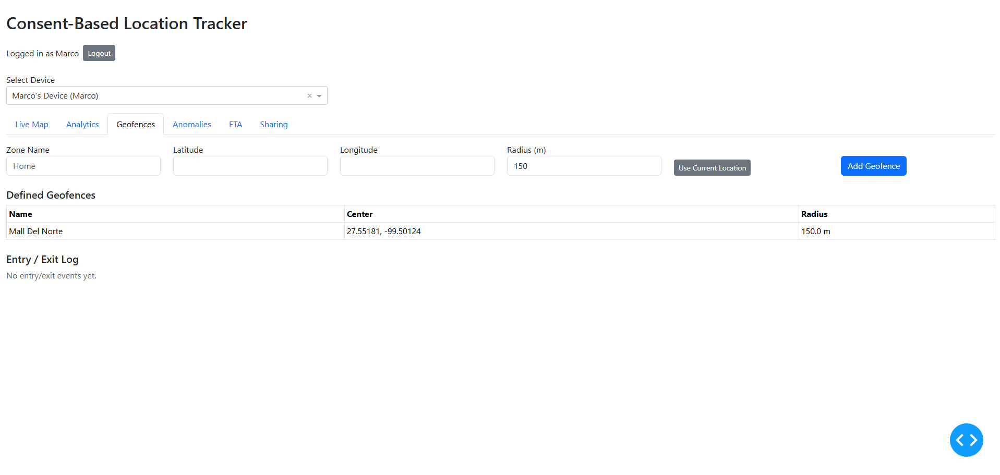
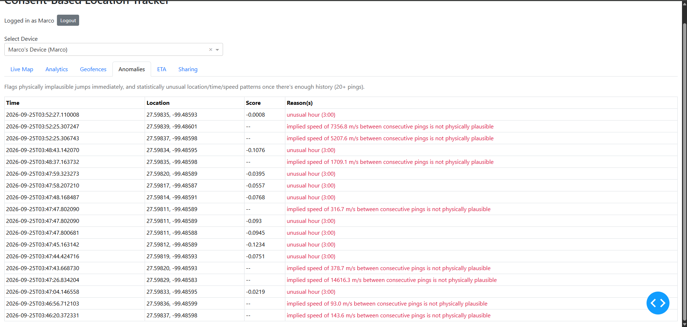
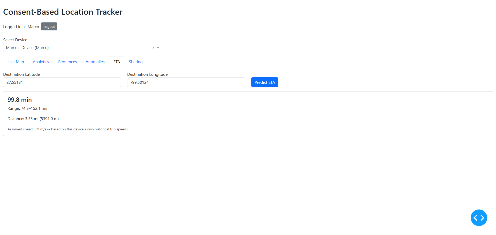
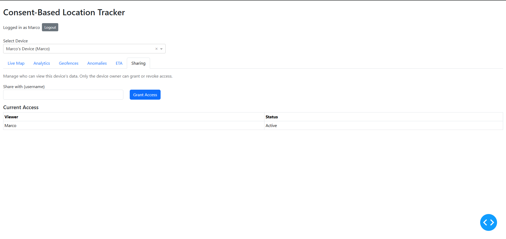

# Consent-Based Location Tracker

A full-stack, consent-based location-sharing and geospatial analytics platform. A device (a phone's browser, or a simulator) reports its own GPS location only while sharing is explicitly turned on; a FastAPI backend authenticates requests, stores the data in Postgres/PostGIS, and a set of ML models turn raw pings into distance/speed stats, auto-detected frequent places, discrete trips, geofence entry/exit events, anomaly flags, and ETA predictions -- all viewable on a live Plotly Dash dashboard.

**Live backend:** https://gps-detect-tracker.fly.dev
**API docs (Swagger):** https://gps-detect-tracker.fly.dev/docs
**Web GPS client:** https://gps-detect-tracker.fly.dev/client/

> The dashboard (the map/tabs UI) currently runs locally (`dashboard/app.py`) and points at the live backend above -- it is not yet deployed as a public site.

---

## Screenshots

<!--
Add your own screenshots here before pushing. Suggested shots and where to save them:

  screenshots/live-map.png         -- Live Map tab with a real route
  screenshots/analytics.png        -- Analytics tab: KPIs + frequent-locations cluster + trips table
  screenshots/geofences.png        -- Geofences tab with a defined zone and an entry/exit log
  screenshots/anomalies.png        -- Anomalies tab showing flagged points
  screenshots/eta.png              -- ETA tab with a prediction result
  screenshots/sharing.png          -- Sharing tab with a granted viewer
  screenshots/swagger.png          -- Swagger docs (https://gps-detect-tracker.fly.dev/docs)

Then uncomment the lines below (or replace with your own paths):
-->
<!--  -->
<!--  -->
<!--  -->
<!--  -->
<!--  -->
<!--  -->

---

## Architecture

```
                    +--------------------+
                    |  Real GPS Client   |  (browser Geolocation API)
                    |  (static/index.html)|
                    +---------+----------+
                              |
                    +---------+----------+
                    |  GPS Simulator     |  (Python, fakes device movement)
                    |  (simulator/)      |
                    +---------+----------+
                              |  HTTPS + JWT
                              v
                    +--------------------+
                    |     FastAPI        |  auth . devices . locations
                    |     (backend/)     |  analytics . geofencing . anomaly . ETA
                    +---------+----------+
                              |
              +---------------+---------------+
              v               v               v
        Supabase          scikit-learn     JWT / bcrypt
        Postgres          (DBSCAN,         (auth.py)
        + PostGIS         Isolation Forest)
              |
              v
     +--------------------+
     |   Plotly Dash       |  Live Map . Analytics . Geofences
     |   (dashboard/)       |  Anomalies . ETA . Sharing
     +--------------------+
```

---

## Features

| # | Feature | Status |
|---|---|---|
| 1 | Consent-based location ingestion (simulator + real-GPS web client) | Done |
| 2 | Managed Postgres + PostGIS (Supabase), not local SQLite | Done |
| 3 | Native Android/iOS client | Substituted with a browser-based real-GPS client |
| 4 | Distance/speed/duration analytics per device | Done |
| 5 | Auto-detected frequent places via DBSCAN clustering | Done |
| 6 | Anomaly detection: rule-based implausible-speed check + Isolation Forest | Done |
| 7 | Geofencing with server-side ENTERED/LEFT audit log | Done |
| 8 | ETA prediction from a device's own historical trip speeds | Done |
| 9 | Cloud deployment (Fly.io) | Done |
| -- | JWT auth, per-device ownership, explicit multi-user sharing grants | Done |

---

## Tech stack

| Layer | Tech |
|---|---|
| Backend API | Python, FastAPI, SQLAlchemy |
| Database | Supabase (managed Postgres) + PostGIS extension |
| Auth | JWT (`python-jose`), `passlib`/`bcrypt` password hashing |
| ML / Analytics | scikit-learn (`DBSCAN`, `IsolationForest`), NumPy |
| Frontend (analyst dashboard) | Plotly Dash, Dash Bootstrap Components |
| Frontend (device client) | Vanilla JS, browser Geolocation API |
| Deployment | Docker, Fly.io |

---

## API examples

All endpoints except `POST /locations` (the device ping endpoint) require a Bearer token from `POST /auth/login`. Tokens below are illustrative -- yours will differ.

**Register + log in**
```bash
curl -X POST https://gps-detect-tracker.fly.dev/auth/register \
  -H 'Content-Type: application/json' \
  -d '{"username": "demo", "password": "your-password"}'
# -> {"id": 12, "username": "demo"}

curl -X POST https://gps-detect-tracker.fly.dev/auth/login \
  -d 'username=demo&password=your-password'
# -> {"access_token": "<jwt>", "token_type": "bearer"}
```

**Analytics summary**
```bash
curl https://gps-detect-tracker.fly.dev/devices/4/analytics/summary \
  -H 'Authorization: Bearer <jwt>'
```
```json
{
  "total_distance_m": 197.6,
  "total_distance_mi": 0.12,
  "avg_speed_mps": 0.51,
  "max_speed_mps": 1.71,
  "duration_minutes": 6.1,
  "num_points": 199
}
```

**Auto-detected frequent places (DBSCAN)**
```json
[
  {
    "cluster_id": 0,
    "center_lat": 27.598321,
    "center_lon": -99.485954,
    "num_visits": 199
  }
]
```

**ETA prediction**
```bash
curl -X POST https://gps-detect-tracker.fly.dev/eta \
  -H 'Authorization: Bearer <jwt>' -H 'Content-Type: application/json' \
  -d '{"device_id": 4, "dest_lat": 27.5501, "dest_lon": -99.5789}'
```
```json
{
  "distance_m": 10618.9,
  "distance_mi": 6.6,
  "predicted_eta_minutes": 196.6,
  "eta_interval_minutes": [146.3, 299.6],
  "assumed_speed_mps": 0.9,
  "method": "historical",
  "num_historical_trips_used": 49
}
```

**Trip detection**
```json
[
  {
    "trip_number": 1,
    "start_time": "2026-09-25T03:46:20.349161",
    "end_time": "2026-09-25T03:52:28.066469",
    "total_distance_mi": 0.12,
    "avg_speed_mps": 0.51,
    "duration_minutes": 6.1,
    "num_points": 199
  }
]
```

---

## Running locally

```bash
git clone https://github.com/<your-username>/gps-tracker.git
cd gps-tracker

# Backend
cd backend
python -m venv venv
venv\Scripts\activate          # Windows; use `source venv/bin/activate` on macOS/Linux
pip install -r requirements.txt
cp .env.example .env           # fill in your own DATABASE_URL and JWT_SECRET
uvicorn main:app --reload

# Dashboard (new terminal)
cd ../dashboard
python -m venv venv
venv\Scripts\activate
pip install -r requirements.txt
python app.py                  # http://localhost:8050

# Simulator (new terminal, optional)
cd ../simulator
pip install requests
python gps_simulator.py --username youruser --password yourpass
```

---

## Deployment

The backend is deployed as a Docker container on Fly.io, with the real-GPS web client served as a static route (`/client/`) from the same FastAPI app.

```bash
# One-time setup
flyctl auth login
cd backend
flyctl launch          # detects the Dockerfile; say NO to Fly's own Postgres/Redis (using Supabase)
flyctl secrets set DATABASE_URL="your-supabase-connection-string"
flyctl secrets set JWT_SECRET="your-jwt-secret"

# Every subsequent deploy
flyctl deploy
```

**Pushing this project to your own GitHub repo:**
```bash
cd gps-tracker
git init
git add .
git commit -m "Initial commit: full-stack consent-based location tracker"
git branch -M main
git remote add origin https://github.com/<your-username>/gps-tracker.git
git push -u origin main
```

---

## Engineering notes

A few real debugging findings worth knowing about, not just the feature list:

- **GPS jitter looks like an anomaly.** Two consecutive browser Geolocation readings a fraction of a second apart, with slightly different coordinates, can produce an "implied speed" of thousands of m/s. The rule-based anomaly check correctly flags this -- a real system would need to debounce pings below some minimum time interval before computing implied speed.
- **`IsolationForest(contamination=0.05)` always flags ~5% of points**, even in a single short, uneventful session -- that's the parameter's job, not a bug. It's a meaningful caveat for any fixed-contamination anomaly model on a small dataset.
- **A self-share (sharing a device with its own owner) caused duplicate rows** in the `GET /devices` response, since owned and shared devices were concatenated without deduplication. Fixed by deduplicating the combined result by device ID.
- **A Dash callback bound to a dynamically-created "Logout" button fired once automatically** the moment the button was first rendered (not on an actual click), silently resetting the auth token right after a successful login. Fixed by guarding the callback against a falsy `n_clicks`.

---

## License

MIT (or your preferred license -- add a LICENSE file if you want this enforced)
